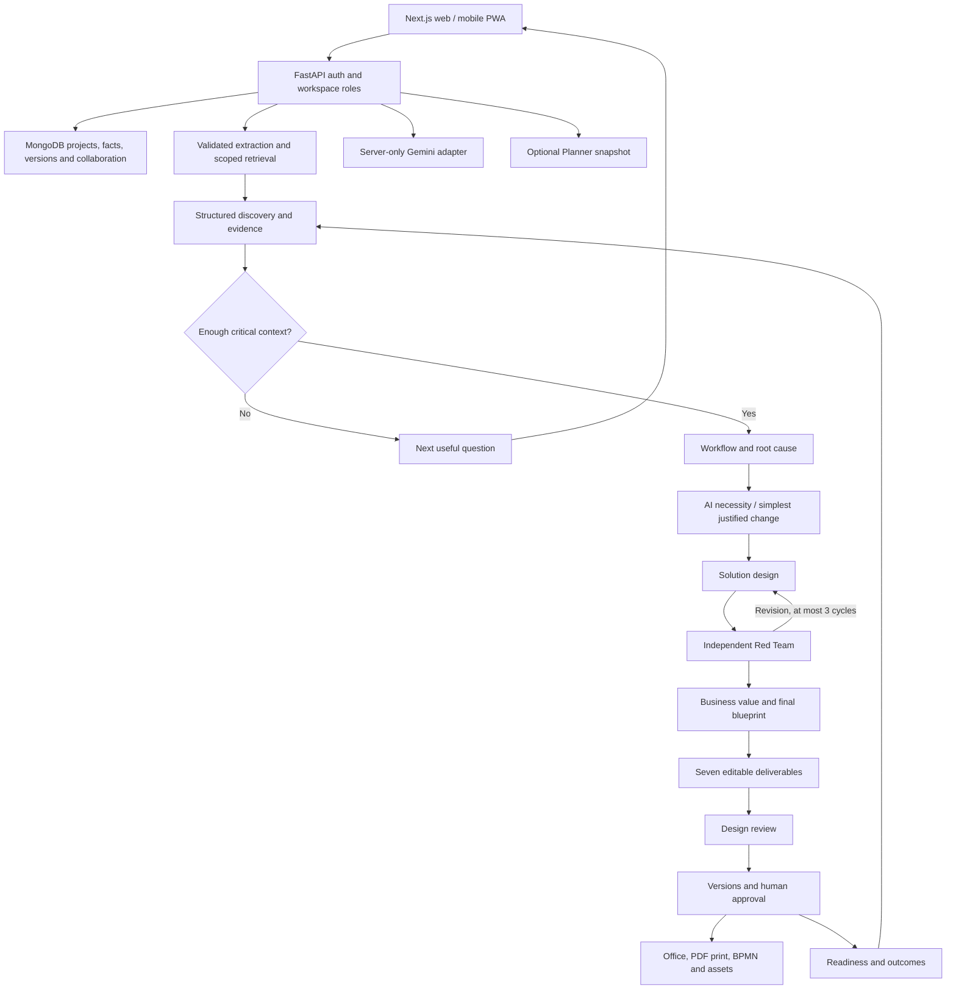

# Organizer requirements and current coverage

Reviewed on 9 September 2026 against `AI Solution Builder.pdf` (five pages), the project SRS, and `understand.txt`. The organizer's minimum scope takes precedence over exclusions in the narrower SRS.

The product remains discovery-first: collect evidence, reconstruct the current system, identify root causes, decide whether AI is justified, design the minimum effective change, challenge it, and refine it. The implementation studio requires completed core analysis before AI generation. Manual drafts are distinguished from AI-reviewed output.

## Application features

| Requirement | Implementation and qualification |
| --- | --- |
| Companion and context | Persistent messages, structured facts/missing information, document evidence, output language, organization policy and measured outcomes. Discovery gates and evidence isolation are tested; latest live Gemini run failed. |
| Business analysis | Business deliverable: requirements, stakeholders, gaps, current/future state, maturity and business case. Typed sections/tables and evidence-backed assessments; unknown evidence stays unknown. |
| Architecture | HLD/LLD, component/integration contracts, cloud/infrastructure, identity/security, environments, monitoring, backup and rollback. Architecture and data-flow diagrams required. A design does not prove deployment or compliance. |
| Process intelligence | Workflows, handoffs, approvals, exceptions, BPMN, swimlanes and decision trees. Editable graph nodes/edges with reference validation; BPMN XML and diagram interchange export. Not an executable BPMN engine. |
| UX | Personas, journeys, navigation, accessibility and at least three screen wireframes with controls. Editable design previews; not generated production apps. |
| Database/API | ER/data-flow diagrams, field catalogue, REST contracts, SQL and OpenAPI assets. Requires SQL and parseable OpenAPI 3 YAML with info and REST paths. SQL is never executed; engineering validation is still required. |
| Estimation/planning | Work breakdown, effort ranges, assumptions, resources, currency-labelled costs, sprints/releases, milestones, risks and change management. Unknown rates cannot be presented as measurements. |
| Transformation planning | Adoption, modernization, automation, migration, implementation gates and ongoing KPIs. A no-AI outcome is supported; unnecessary AI/cloud migration must be marked inapplicable. |
| Transformation dashboard | Discovery, current design coverage, version-specific approvals, open AI findings, project stage, maturity/readiness/opportunity assessments and measured outcomes. Ratings are advisory with evidence. |
| Document inputs | PDF, DOCX, PPTX, XLSX, CSV and TXT; bounded extraction, validation and source metadata. Convert legacy `.ppt` to `.pptx`; scanned PDFs/images still need external OCR. |
| Exports | DOCX, XLSX, PPTX, Markdown, JSON, ZIP and BPMN; browser Print / Save as PDF. Office files pass parser round-trip tests; spreadsheet text cannot become formulas. Office output contains editable text/tables; browser PDF includes rendered visuals. |
| Edit/regenerate/version | Visual field editor, append-only versions, historical viewing/restoration, optimistic conflicts and stale-context markers. Earlier saved versions survive provider failure; approvals do not transfer to new versions. |
| Red Team | Separate structured critique, at most three revision cycles, retained findings and proposal history. Core initial/revised proposals are inspectable. Unresolved findings remain visible after the limit. |
| Collaboration | Organization/workspace labels, shared projects, expiring single-use invitations, comments, approvals, notifications and activity. Owner/admin/editor/reviewer/viewer permissions enforced server-side, including revocation. |
| Administration | Members/roles, projects, model override, AI governance instructions, retention target, health, deliverable-operation duration/outcome telemetry, activity, integration and backup controls. Not token billing or automated compliance. Retention is a target, not automatic deletion. |
| Email authentication | Real signup/login, salted PBKDF2-SHA256 hashes, signed HttpOnly sessions, rate limits, Origin checks and isolation. No Google key needed. Email verification/reset delivery, MFA and enterprise SSO are not implemented. |
| Enterprise integration | Encrypted Microsoft Graph connection; import assigned Planner tasks as bounded discovery evidence. Fixed host/operations, role checks and no token disclosure. Contract tested with a substitute; live tenant consent/token needed. No token refresh or broad connector catalogue. |
| Multilingual | Twenty language choices, core navigation/auth translations, cached opt-in AI translation of allowlisted interface copy, localized prose and RTL. Failure retains source text; some dynamic messages/technical identifiers remain English. Complete reviewed localization is not established. |
| Web/mobile/tablet | Responsive web, installable manifest, production service worker and offline notice. Desktop/mobile Chromium emulation passed. No app-store binaries or physical-device certification; private project responses are not cached offline. |
| Backup/recovery | Workspace backup and restore into new project copies, remapped document IDs, stale restored deliverables and downloadable archived reviews. Existing projects are retained; approvals are historical, never trusted as new approval. Not database PITR or a DR drill. |

## Runtime architecture

## Limits before a full enterprise-compliance claim

1. **Live dependencies:** configured Gemini credentials returned service/quota/permission errors. The project's Atlas cluster failed TLS negotiation from this environment after intermittent DNS failures. Resolve network/provider access, then repeat live discovery through all seven outputs. Deterministic tests do not establish AI quality or provider reliability.
2. **Production operations:** TLS ingress, secure cookies, `ALLOW_LOCAL_ACCESS=false`, restricted database credentials, managed encryption at rest, backup/PITR, monitoring, load testing and recovery drills require deployment configuration. Jobs have a 30-minute lease and can be retried after interruption; no durable step-resume queue. HA, latency guarantees and compliance certification are not established.
3. **Enterprise completion:** real Microsoft consent/token lifecycle, any additional connectors, data-classification/retention enforcement, enterprise identity and platform-wide billing analytics.
4. **Devices/languages:** physical Android/iOS/tablet checks and complete reviewed translations. Native binaries are only needed if the organizer requires native distribution rather than browser/PWA access.
5. **Video:** the supplied SharePoint Stream page and media path were inaccessible; a direct request returned HTTP 403. The video was not viewed or used as evidence. Place an accessible copy/transcript under `docs` for the remaining comparison.

## Demo sequence

1. Sign up, create a team/project and describe the business problem.
2. Answer discovery questions, upload an SOP and show facts/gaps before analysis.
3. Run core analysis; show root cause, AI/non-AI decision, critique and proposal history.
4. Generate deliverables, inspect diagrams/wireframes/API assets, edit and save a new version.
5. Review, comment, export, then change a constraint to demonstrate stale-version protection.
6. Show readiness/outcomes in Transformation and roles/activity/backup in Teams & admin.

Present estimates as assumptions, distinguish AI critique from human approval, and avoid claiming an untested cloud design is a working deployment.
